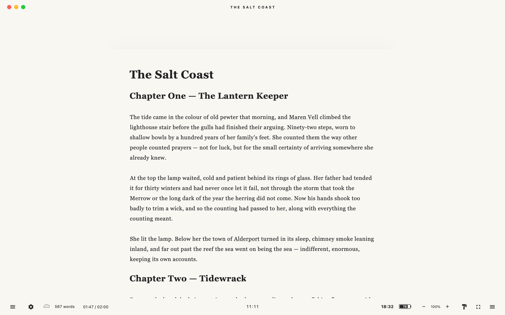
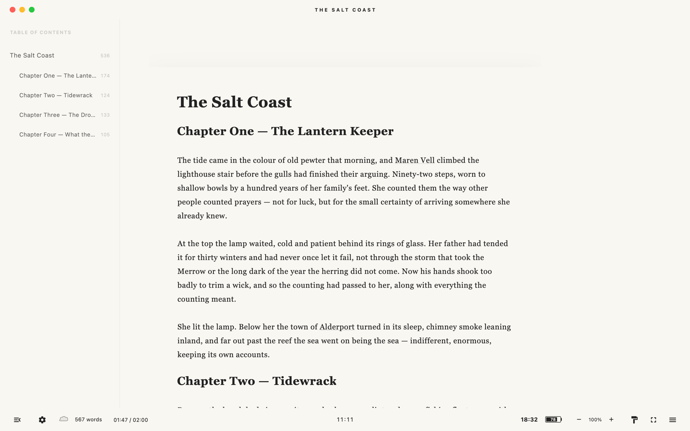
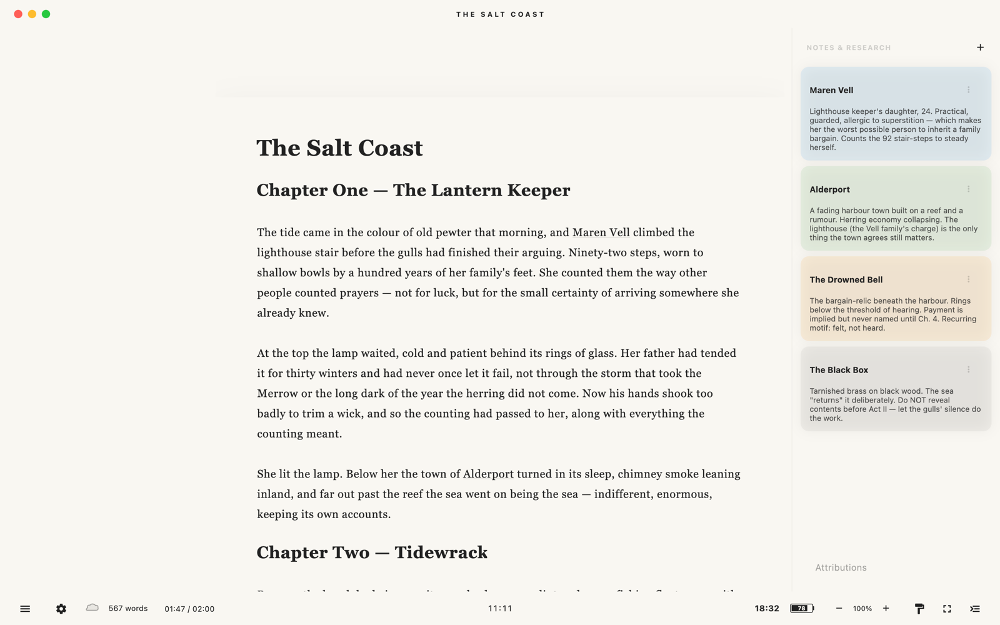
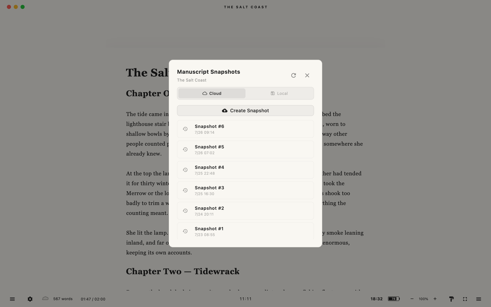
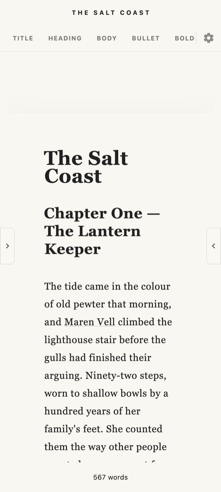
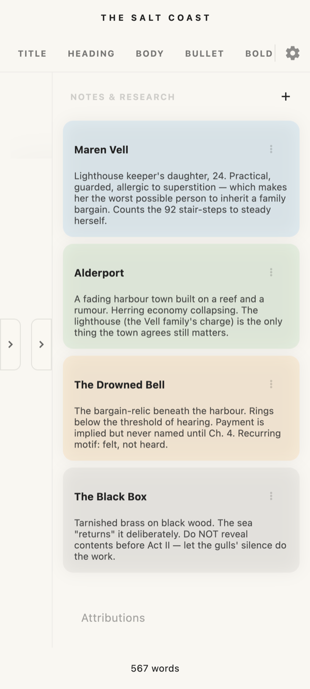

# Pellucid

Pellucid is a local-first Markdown writing app for longform fiction. It keeps the manuscript at the center, saves work into ordinary project folders, and offers optional Google Drive backup without hiding the user's files.

The interface uses **Whisper UI**: controls stay visually quiet until they are hovered, focused, or summoned by keyboard shortcut. The goal is a writing surface that feels calm without removing power tools.

## Screenshots

<table>
  <tr>
    <td width="50%"></td>
    <td width="50%"></td>
  </tr>
  <tr>
    <td width="50%"></td>
    <td width="50%"></td>
  </tr>
</table>

<sub>Pellucid on macOS — the Whisper UI keeps controls quiet until you need them.</sub>

<table>
  <tr>
    <td width="50%" align="center"></td>
    <td width="50%" align="center"></td>
  </tr>
</table>

<sub>Android and iOS builds adapt the same manuscript-first layout.</sub>

## Features

- Markdown manuscript editor with hidden formatting markers for headings, bullets, bold, italic, and underline.
- Multi-project dashboard backed by user-owned folders.
- Research notes with categories, bidirectional links, source URLs, and an attribution workflow.
- Table of contents generated from Markdown headings, including per-section word counts.
- Search and replace with match navigation and in-editor highlights.
- Typewriter scrolling, paragraph focus, fullscreen mode, timers, alarms, pomodoro, and writing sprints.
- Daily writing goals and per-project word targets.
- Rolling local snapshots in each project, independent of cloud sync.
- Optional Google Drive backup through a visible `Pellucid Vault` folder.
- PDF and EPUB export.
- Theme presets plus a custom theme designer.
- Desktop-focused UX with mobile adaptations for Android and iOS.

## Quick Start

```powershell
cd writer_app
flutter pub get
flutter run -d windows
```

Use another Flutter device id if you are targeting a different platform.

## Test And Analyze

```powershell
cd writer_app
flutter test
flutter analyze
```

The test suite covers editor behavior, storage, local snapshots, settings, stats, sync, notes, search and replace, shortcuts, focus modes, mobile layout, and the table of contents parser.

## Local Storage

Pellucid asks for a master storage folder. Each project is stored as a normal folder inside it:

```text
<master>/<ProjectName>/
  document.md
  notes.json
  stats.json
  categories.json
  .history/
```

`document.md` is the manuscript. `notes.json` stores research notes and attributions. `stats.json` stores project totals. `categories.json` stores custom note categories. `.history/` contains rolling local manuscript snapshots.

## Google Drive Sync

Google Drive sync is optional. When connected, Pellucid creates a visible `Pellucid Vault` folder in Drive and stores project backups there. The app supports custom OAuth credentials from settings, and the cloud auto-sync interval can be adjusted from the dashboard.

Local autosave and local snapshots work without Google Drive.

## Keyboard Basics

Shortcuts below are for macOS, the primary platform.

- `Cmd + Opt + 1`: Toggle table of contents.
- `Cmd + Opt + 2`: Toggle research notes.
- `Cmd + Opt + 3`: Toggle formatting toolbar.
- `Cmd + Opt + 5`: Toggle typewriter scrolling.
- `Cmd + Opt + 6`: Toggle paragraph focus.
- `Cmd + Opt + Enter`: Toggle fullscreen.
- `Cmd + F`: Search.
- `Cmd + Opt + N`: Add a note.
- `Cmd + Opt + A`: Open attributions.
- `Cmd + Opt + Shift + S`: Toggle writing sprint.

On macOS, open settings from the system menu bar. On Windows and Linux, use `Alt` in place of `Cmd + Opt`, `Ctrl + F` for search, `Alt + 4` to open settings, and `F11` for fullscreen.

## Build Targets

macOS is the primary distribution target — the Mac build is essentially release-ready and ships first. The Flutter project also includes Windows, Linux, Android, iOS, and web targets, which follow.

## Public Documentation Policy

Markdown files are ignored by default so local project-management and planning notes do not get committed accidentally. Public documentation is opt-in: only explicitly approved Markdown files, such as this README, should be unignored and committed.
